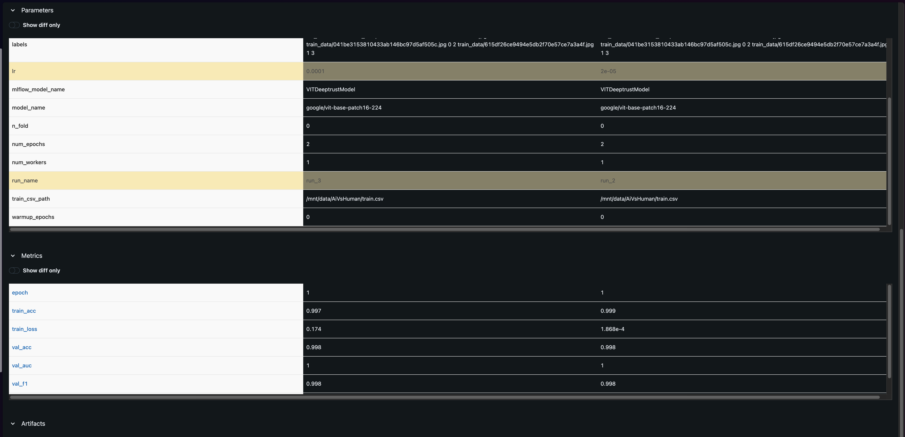
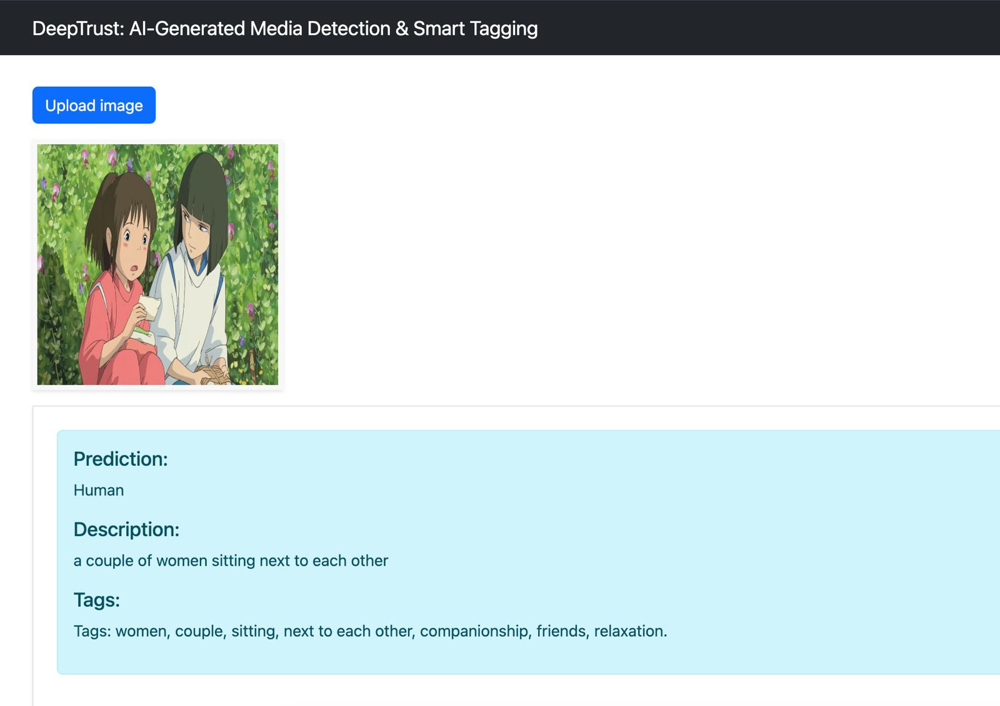

## DeepTrust: AI-Generated Media Detection & Smart Tagging

<!-- 
Discuss: Value proposition: Your will propose a machine learning system that can be 
used in an existing business or service. (You should not propose a system in which 
a new business or service would be developed around the machine learning system.) 
Describe the value proposition for the machine learning system. What’s the (non-ML) 
status quo used in the business or service? What business metric are you going to be 
judged on? (Note that the “service” does not have to be for general users; you can 
propose a system for a science problem, for example.)
Main focus is does it make us some money, should project be approved
Scale Requirement : List dataset size, list model size, no of parameters
Value Proposition : I want you to tell me exactly who is the customer who I'm gonna sell this to. Who is the ONE customer, name them. It can be a made up name like EXinterest not necessirly "Pinterest". Make sure they are suitable for the suitable context they're deployed in. To what extent can we satify the requirements of the customer. Tell something about the customer. What number of posts do they get in a day. NAME THE CUSTOMER. 
She also needs specific data about their volume and how we satisfy it
Status Quo: Name the business, give specifics, whats the current situation
Outside Materials: provide link, enumerate every dataset, link to a paper who created, when where how of the dataset
Mention dataset sizes, Answer her questions also, is it an ongoing?
Privacy/Fairness/Ethics Issues -  think about it. Either data or the system itself. The system itself has potential to cause harm, for example: chest Xrays
Business Metrics: Throughput, latency etc dont count. Click Through Rate, More customers will buy, more customers will spend less time doing something
-->

Proposing a system that can be used inside Flickr to increase transparency by using an ML model to detect/flag AI-generated images for potential review and enabling LLM based auto-captioning to tag images for indexing.

**Value Proposition:** By incorporating AI vs. human image detection, Flickr can provide users with authenticity in visual content, helping them distinguish between real and AI-generated images. This is particularly valuable for photographers who rely on Flickr for genuine community shared content. Additionally, auto-captioning and tagging allowing the Flickr team to tag images more efficiently and thereby enhancing searchability. Moreover, the description and tags generated will be meaningful opening up avenues for future work. These improvements can boost user engagement, content organization, and accessibility, making Flickr a popular platform.

<!-- The platform will be able to moderate content better and prevent misinformation using the tags provided by the model. Additionally, the automatic tagging mechanism can also be used in content indexing. -->

**Status Quo:** Users are consuming content on Flickr without any indication of whether an image is AI-generated or authentic, which can lead to misinformation and difficulty in verifying sources. We have noticed articles online [(Reddit: AI Content is Putting Me Off)](https://www.reddit.com/r/flickr/comments/1bajy3p/ai_content_is_putting_me_off/) of users expressing frustration over increasing number of AI generated images on Flickr. Currently, content is uploaded with manual captions that may or may not be accurate, detailed, or useful for search and discovery. Many users either leave captions blank, use vague descriptions, or provide misleading tags, making it difficult to retrieve relevant images efficiently. Additionally, without standardized metadata, content moderation and manually identifying inappropriate or AI-generated content at such scale is impractical.

Flickr boasts of 10billion photos shared since inception with about 25 million photos shared daily. That translates to a concurrency requirement of 300/second. The system we are proposing right now can handle upto 50 requests/second with the capability of scaling more.

<!-- 
Users are consuming content with no way of knowing if it is AI-generated or not. Content is being uploaded with manual captions that may or may not help with information retrieval or censorship. -->

**Business Metric:** 
- Preventing Misinformation
  - By clearly labeling AI-generated images, Flickr can help users make informed decisions about the content they consume, increasing trust and transparency of Flickr.
- Faster Content Retrieval
  - AI-powered auto-captioning and tagging improves searchability, enabling users to find relevant images more quickly, thereby enhancing user experience and engagement on Flickr.

### Contributors

<!-- Table of contributors and their roles. 
First row: define responsibilities that are shared by the team. 
Then, each row after that is: name of contributor, their role, and in the third column, 
you will link to their contributions. If your project involves multiple repos, you will 
link to their contributions in all repos here. -->

Team Name: 

| Name            | Responsible for                       | Link to their commits in this repo                                                                                           |
| --------------- | ------------------------------------- | ---------------------------------------------------------------------------------------------------------------------------- |
| Team AMPS!      |                                       |                                                                                                                              |
| Ansh Sarkar     | Model Training (Unit 4&5)             | https://github.com/SimranKucheria/ECE-GY-9183-Machine-Learning-Systems-Engg-Operations-Project/commits?author=anshsarkar     |
| Manali Tanna    | Model Serving & Monitoring (Unit 6&7) | https://github.com/SimranKucheria/ECE-GY-9183-Machine-Learning-Systems-Engg-Operations-Project/commits?author=ManaliTanna    |
| Princy Doshi    | Data Pipeline (Unit 8)                | https://github.com/SimranKucheria/ECE-GY-9183-Machine-Learning-Systems-Engg-Operations-Project/commits?author=princydd17     |
| Simran Kucheria | Continuous Pipeline (Unit 3)          | https://github.com/SimranKucheria/ECE-GY-9183-Machine-Learning-Systems-Engg-Operations-Project/commits?author=SimranKucheria |


### System diagram

<!-- Overall diagram of system. Doesn't need polish, does need to show all the pieces. 
Must include: all the hardware, all the containers/software platforms, all the models, 
all the data. -->

<!-- Insert image here -->


### Summary of outside materials

<!-- In a table, a row for each dataset, foundation model. 
Name of data/model, conditions under which it was created (ideally with links/references), 
conditions under which it may be used. -->

|                                                   | How it was created                                                                                                                                                                                                                                                                                                                                                                                                                                                                                                        | Conditions of use                                                                                                                                                                                                                                                                                                                                                                                                |
| ------------------------------------------------- | ------------------------------------------------------------------------------------------------------------------------------------------------------------------------------------------------------------------------------------------------------------------------------------------------------------------------------------------------------------------------------------------------------------------------------------------------------------------------------------------------------------------------- | ---------------------------------------------------------------------------------------------------------------------------------------------------------------------------------------------------------------------------------------------------------------------------------------------------------------------------------------------------------------------------------------------------------------- |
| AI vs. Human-Generated Images                     | Images sampled from the Shutterstock platform across various categories, including a balanced selection where one-third of the images feature humans. These authentic images are paired with their equivalents generated using state-of-the-art generative models. Link to dataset: https://www.kaggle.com/datasets/alessandrasala79/ai-vs-human-generated-dataset Size of Dataset: 13Gb                                                                                                                                  | Licensed under Apache 2.0 - a permissive open-source license that allows users to modify, distribute, and sublicense the original code, but requires including the original copyright notice, a copy of the license, and any significant changes made to the code.                                                                                                                                               |
| Flickr Image Dataset                              | A new benchmark collection for sentence-based image description and search, consisting of 30,000 images that are each paired with five different captions which provide clear descriptions of the salient entities and events. … The images were chosen from six different Flickr groups, and tend not to contain any well-known people or locations, but were manually selected to depict a variety of scenes and situations Link to dataset: https://www.kaggle.com/datasets/adityajn105/flickr30k Size of Dataset: 5Gb | Licensed under Creative Commons Attribution 4.0 License, lets you distribute, remix, tweak, and build upon your work, even commercially, as long as you credit the original creator.                                                                                                                                                                                                                             |
| Vision Transformers (google/vit-base-patch16-224) | google/vit-base-patch16-224 is a Vision Transformer (ViT) model for Image Recognition at Scale. This model adapts the transformer architecture, originally designed for language, to process images by dividing them into fixed-size patches and treating each patch as a token in a sequence. Link to Paper: https://arxiv.org/pdf/2010.119290                                                                                                                                                                           | The Google ViT model was pretrained on the ImageNet-21k dataset and finetuned on ILSVRC2012 dataset. The model is available on the Hugging Face Model Hub, but the original Google researchers did not provide a specific model card or explicit license with the model weights. However, models on Hugging Face are typically distributed under open and research-friendly licenses unless otherwise specified. |
| BLIP                                              | BLIP (Bootstrapping Language-Image Pre-training) is a multimodal model that combines vision and language understanding. It is designed to generate captions for images and perform various vision-language tasks. BLIP is pretrained on large-scale datasets, including COCO and Conceptual Captions, using a combination of self-supervised learning and supervised fine-tuning. Link to Paper: https://arxiv.org/pdf/2201.12086.pdf                                                                                     | The BLIP model is available under the Apache 2.0 license, which allows for both commercial and research use without restriction. The model weights are available on the Hugging Face Model Hub, making it accessible for various applications.                                                                                                                                                                   |
| mistralai/Mistral-7B-Instruct-v0.2                | The mistralai/Mistral-7B-Instruct-v0.2 model is a 7.3-billion-parameter instruction-tuned language model optimized for natural language tasks. It is a decoder-only transformer model fine-tuned for instruction-following tasks. Link to reference: https://huggingface.co/mistralai/Mistral-7B-Instruct-v0.2                                                                                                                                                                                                            | The original Mistral-7B base model was pretrained on a large, diverse corpus of text data. However, the exact datasets used for pretraining have not been publicly disclosed by Mistral AI. The model is distributed under the Apache 2.0 license, which allows for both commercial and research use without restriction.                                                                                        |


### Summary of infrastructure requirements

<!-- Itemize all your anticipated requirements: What (`m1.medium` VM, `gpu_mi100`), 
how much/when, justification. Include compute, floating IPs, and persistent storage. 
The table below shows an example, it is not a recommendation. -->

| Requirement                             | How many/when                                     | Justification |
| --------------------------------------- | ------------------------------------------------- | ------------- |
| `m1.medium` VMs                         | 3 for entire project duration                     | Used to expose the application using K8s           |
| 2 Baremetals (1 with 2 GPUs, 1 with 1 GPU)   | 6 hour block thrice a week   | Training/Retraining/Serving           |
| Floating IPs  - 3 | 1 for K8s, 2 for Baremetals | Expose all instances          |
| Fast SSD(Persistent Storage)            | 50Gb Duration of entire project  | Used for block storage|
| Fast SSD(Object Storage)            | 100Gb Duration of entire project  | Used for object storage|

### Detailed design plan

<!-- In each section, you should describe (1) your strategy, (2) the relevant parts of the 
diagram, (3) justification for your strategy, (4) relate back to lecture material. 
(5) include specific numbers. -->

#### Model training and training platforms

<!-- Make sure to clarify how you will satisfy the Unit 4 and Unit 5 requirements, 
and which optional "difficulty" points you are attempting. -->
##### Objectives

- **Modeling**: To solve the problems and achieve the objectives of the system, we decided to use Vision Transformers (ViT) and RegNet for image classification which takes input as an image, BLIP model for image captioning which takes text as an input and a LLM model which takes text as inputs for generating meaningful tags for the captions that can be used for indexing. For evaluation we needed a dataset classifier model as well to differentiate between Shutterstock images and Flckr images. The output of the ViT model will be a class label (AI generated or not) and the output of the BLIP model will be a caption. The output of the LLM model will be a set of tags for the image. We decided not to finetune the LLM model as it is already pretrained on a large dataset and can be used for our use case. The mistralai/Mistral-7B-Instruct-v0.2 model is a 7.3-billion-parameter decoder-only instruction-tuned language model. BLIP is a multimodal model that can generate captions for images and is pretrained on a large dataset. The BLIP model is a transformer-based model that uses attention mechanisms to generate captions for images.  The Google Vit model is a transformer-based model that uses attention mechanisms to classify images and has proven to be effective in image classification tasks. The whole system is for internal use where Flickr images are being flagged by the system with AI or Human tag and other tags that can be useful in providing a better customer experience. The system will be used by the Flickr team to moderate content and provide better search results for users. We want these tags to be as accurate as possible. We chose the ViT and BLIP models because not only they are state of the art models but can be finetuned for our use cases. 

- **Train and re-train**: We decided to train only the BLIP and ViT models as the data to these models will be different from what we have in the pretrained models. LLM is only used for generating tags and it is also instruction tuned. The BLIP model will be finetuned on the Flickr dataset and the ViT model will be finetuned on the AI vs Human dataset. We will use the pretrained weights of the models to finetune them for our use case. The training will be done using a ray cluster and we will use MLFlow to track the experiments and the models. All the training code can be in the following:
  - Train code: [All the Training code](/src/train/)
  - Vit Train code: [Vit Train code](/src/train/aivshuman/train.py)
  - BLIP Train code: [BLIP Train code](/src/train/train.py)
<!--   
- **Modeling**: We have two tasks to solve. First one being an image classification problem we are going ahead with either a RegNet model or a ViT model as these models are known to perform well in image classification tasks and we can use their pretrained weights to finetune for our use case. For image captioning as the second task we have decided to go ahead with a multimodel LLM model (Qwen/Qwen2-VL-7B) as it is pretrained on a large dataset and can be finetuned for image captioning. The pretrained knowledge of the model will help us in generating more meaningful captions and tags. -->
  
- **Experiment tracking**: Both the model will be tracked using MLFlow to track model experiments, hyperparameters and metrics. This will help us in logging the model performance and also help us in comparing the models. We were able to test and compare few models by changing hyperparemeters such as learning rate. An example can be seen here: 
  
- **Scheduling training jobs**: All the jobs required for training/re-training can be submitted via making a request to an API endpoint which has been exposed to take train and re-train requests. There are different parameters that can be passed to the API endpoint such as model name, dataset path, hyperparameters etc. For both the models making an API call will start a subprocess. For the ViT model this can be tracked on Ray as ViT training is done using a Ray Job.
    - Training setup for ViT model: [Vit Training setup](/src/train/app.py)
    - Training setup for BLIP model: [BLIP Training setup](/src/train/server.py)
    - All these services were brought up using containers and the implementation for that can be found if this file: [Train Infrastructure](/src/train/train-infrastructure.yaml)

##### Extra Difficulty

- **Training strategies for large models/Use distributed training to increase velocity**: We trained ViT model with Ray which has the capability to scale up and use DDP strategy for distributed training. We do have an option to use FSDP but we were unable to test that particular option. For BLIP we will use PyTorch and its inbuilt DDP strategy to train the model. For both the models we saw a significant speedup in training time almost by a factor of 2x.
  - Implementation for Vit Model: [ViT strategies](/src/train/aivshuman/train.py#L173-190) 
  ```python
  if config["fsdp"]:
        strategy = ray.train.lightning.RayFSDPStrategy(
            fsdp_config={"fsdp": {"sharding_strategy": "FULL_SHARD"}}
        )
    else:
        strategy = ray.train.lightning.RayDDPStrategy()
    trainer = L.Trainer(
        logger=mlflow_logger,
        callbacks=[early_stop, checkpoint_callback, ray.train.lightning.RayTrainReportCallback()],
        max_epochs=config["num_epochs"],
        accelerator="auto",
        devices="auto",
        enable_progress_bar=True,
        log_every_n_steps=10,
        strategy=strategy,
        plugins = [ray.train.lightning.RayLightningEnvironment()]
    )
  ```
  and
  ```python
  if args.fsdp:
            scaling_config = ScalingConfig(
                num_workers=config.get("num_workers", 2),  
                use_gpu=True, 
                resources_per_worker={"CPU": 8, "GPU": 1},
            )
        else:
            scaling_config = ScalingConfig(
                num_workers=config.get("num_workers", 1),  
                use_gpu=True, 
                resources_per_worker={"CPU": 8, "GPU": 1}  # 
            )
  ```
  - Implementation for BLIP Model: [BLIP strategies](/src/train/server.py#L82-94)
  ```python
  if namespace['evaluate']:
            cmd = [
                "python", "-m", "torch.distributed.run",
                "--nproc_per_node={}".format(nproc_per_node),
                "train.py",
                "--evaluate"
            ]
        else:
            cmd = [
                "python", "-m", "torch.distributed.run",
                "--nproc_per_node={}".format(nproc_per_node),
                "train.py"
            ]
  ```

- **Using Ray Train**: We used Ray Train to train the ViT model. It can be found in the following file: [Ray Train](/src/train/aivshuman/train.py#L173-190). Below are some code snippets from the file:
  ```python
  if config["fsdp"]:
        strategy = ray.train.lightning.RayFSDPStrategy(
            fsdp_config={"fsdp": {"sharding_strategy": "FULL_SHARD"}}
        )
    else:
        strategy = ray.train.lightning.RayDDPStrategy()
    trainer = L.Trainer(
        logger=mlflow_logger,
        callbacks=[early_stop, checkpoint_callback, ray.train.lightning.RayTrainReportCallback()],
        max_epochs=config["num_epochs"],
        accelerator="auto",
        devices="auto",
        enable_progress_bar=True,
        log_every_n_steps=10,
        strategy=strategy,
        plugins = [ray.train.lightning.RayLightningEnvironment()]
    )

    # Log parameters
    mlflow_logger.log_hyperparams(config)
    
    # Train
    trainer.fit(model, train_dataloaders=train_loader, val_dataloaders=val_loader)
  ```
  and 
  ```python
   try:
        if args.fsdp:
            scaling_config = ScalingConfig(
                num_workers=config.get("num_workers", 2),  
                use_gpu=True, 
                resources_per_worker={"CPU": 8, "GPU": 1},
            )
        else:
            scaling_config = ScalingConfig(
                num_workers=config.get("num_workers", 1),  
                use_gpu=True, 
                resources_per_worker={"CPU": 8, "GPU": 1}  # 
            )
        
        run_config = RunConfig(storage_path="s3://ray")
        
        trainer = TorchTrainer(
            train_func,
            train_loop_config=config,
            scaling_config=scaling_config,
            run_config=run_config
        )
        
        result = trainer.fit()
        print("Training completed successfully.")
    finally:
        # ray.shutdown()
        pass
  ```

- **Scheduling hyperparameter tuning jobs**: This was not covered in our current implementation


#### Model serving and monitoring platforms

<!-- Make sure to clarify how you will satisfy the Unit 6 and Unit 7 requirements, 
and which optional "difficulty" points you are attempting. -->

- **Flask Application**: A flask application is the user facing API layer that calls 3 separate model serving endpoints and calls them one after another to display the results.
  - The code for it is in ui_service (src/serving/BLIP) 
  - Here is what it looks like:
  - 
  -  The Flask container is deployed on KVM@TACC.
  -  The GET endpoint renders the main page and is very similar to the one we saw in the Gourmetgram system in class. 
  -  The /predict POST endpoint takes as input an image. It then calls the serving endpoints and outputs the following:
      -  request_fastapi
         -  input is image_path
         -  returns Predicted Class (Human/AI string)
      -  request_triton
         -  input is image_path
         -  returns Caption (string)
      -  request_vllm
         -  input is description
         -  returns Tags (String of comma separated words)
  - Each output also has a little thumbs down button near it which uses the /flag endpoint in order to close the feedback loop.

- **Serving from API endpoint**: The system is exposed through multiple API endpoints that serve each of the 3 models separately. Each service is a dockerized container that lives on CHI@TACC. To bring up the 3 services we can use [docker-compose-serve.yaml](src/serving/docker-compose-serve.yaml). To test locally all services including frontend and monitoring we can use [docker-compose-eval-serve.yaml](src/serving/docker-compose-eval-serve.yaml)
  
  - ViT Model served using FastAPI
    - Code: [infernce_service](src/serving/inference_service)
    - Setup: The Dockerfile is used to set up the application on the container run it and and expose it. The model.pth file is loaded from the directory. And the HTTP /predict endpoint wraps the code that performs model inference.
    - Input: The input is base 64 url encoded image
    - Output: The output is the predicted class (string) and probability
  
  - BLIP Captioning Model served using Triton
    - Code: [BLIP](src/serving/BLIP)
    - Setup: The model name is caption. And it has 1 version of the model model_base_caption_capfilt_large.pth and model.py that tells how to run the model. The exceute() method performs model inference. 
    - Input: The input is an image
    - Output: The ouput is a triton tensor containing the caption.
  
  - Mistral LLM served using vLLM
    - Setup: We directly use the vLLM API using Hugging face to serve Mistral-7B-Instruct-v0.2 
    - Input: The input is a prompt to generate tags for the given image description which is recieved from the BLIP captioning model.
    - Output: The output is a JSON response which contains the tags.
  
- **Identify requirements**: 
  - The system must be highly available and scalable to support global user traffic, including unexpected spikes in usage. However the system does not have to provide inference in real time and can afford to have a delay since the system is used internally and does not directly face the user.
  - Flickr handles approximately 25 million uploads per day, translating to an average of ~300 image uploads per second. The proposed system currently supports up to 50 requests per second, with built-in auto-scaling capabilities to accommodate peak loads.
  - The ideal model inference time (for AI detection and captioning) should be ≤ 5 minutes per request. The API gateway should introduce no more than 200ms of latency. The total end-to-end response time, from image upload to processed output, should not exceed 10 minutes to ensure a scalable and accurate system.


Model and System optimizations:

We use a Triton Server to optimize inference server.

  CODE: [Performance](src/serving/Performance) and [Triton](src/serving/Performance/triton.ipynb)

| Device           | Setup Description                                             | Model Size | Median Inference Time | 95th Percentile | 99th Percentile | Throughput (req/sec) |
|------------------|---------------------------------------------------------------|------------|------------------------|------------------|------------------|------------------------|
| CPU (local)      | Pytorch - FastAPI - RegNet                                    | 566.21 MB  | 861.2221 ms            | 1079.5787 ms     | 1290.1483 s      | 1.12 requests/sec                   |
| CPU (local)      | Concurrent - Pytorch - FastAPI - RegNet                       | 566.21 MB  | 6354.0373 ms           | 7806.5891 ms     | 8986.2466 s      | 2.47 requests/sec                   |
| CPU (local)      | Pytorch - Fast API - ViT - Human Vs AI                        | 346.35 MB  | 157.1559 ms            | 189.3958 ms      | 217.0157 s       | 5.99 resquests/sec                  |
| CPU (local)      | Concurrent - Pytorch - Fast API - ViT - Human Vs AI           | 346.35 MB  | 1564.8777 ms           | 1875.0326 ms     | 2012.6806 s      | 10.01 resquests/sec                  |
| GPU RTX 6000     | Pytorch - Fast API - ViT - Human Vs AI                        | 346.35 MB  | 80.4386 ms             | 96.2464 ms       | 98.2563 s        | 11.87 requests/sec                 |
| GPU RTX 6000     | Concurrent - Pytorch - Fast API - ViT - Human Vs AI           | 346.35 MB  | 1020.3534 ms           | 1111.7043 ms     | 1138.7481 s      | 15.65 requests/sec                 |
| GPU compute_liqid| Concurrency 1 - Pytorch - Triton Server - BLIP - Captioning   | N/A        | 236005 usec            | 240915 usec      | 249794 usec      | 4.21707 infer/sec      |
| GPU compute_liqid| 8 clients Concurrency 1 - Triton - BLIP - Captioning          | N/A        | 1841055 usec           | 1851137 usec     | 1851592 usec     | 4.38366 infer/sec      |
| GPU compute_liqid| 16 clients Concurrency 1 - Triton - BLIP - Captioning         | N/A        | 3734920 usec           | 3736303 usec     | 3738495 usec     | 4.32175 infer/sec      |
| GPU compute_liqid| Batch size 16 - 16 clients - Triton - BLIP - Captioning       | N/A        | 248115 usec            | 253176 usec      | 257178 usec      | 63.9023 infer/sec      |


 For the LLM we use vLLM that takes advantage of PagedAttention, continuous batching, and tensor parallelism to reduce the latency of the model.
  
- **System optimizations**: We can also convert our ViT model to a [ONNX model](src/serving/convert_to_onnx.py) but we didnt get enough time to try that out.

- **Offline evaluation of model**: Our system runs a pytest suite that can be included an automated offline evaluation plan after model training, with results logged to MLFlow. 
  
  - code: [pytest](src/serving/tests)

  - Evaluation on appropriate domain specific metrics for each model. For AI VS Human Image detection using a ViT we use accuracy. For Image description we use BLEU scores.
  - We use grad-cam to see what portions of the images is the model focussing on. [Experiment](src/serving/experiments/RegNet_eval_offline.ipynb)
  - Test on known failure modes for ViT : We test the model on images that are known to be difficult such as AI-generated images mimicking artistic styles like Ghibli Images. 
  - We also run template based test on the BLIP model to ensure the semantic meaning of the prediction doesnt change based on the addition of some words [code](src/serving/tests/test_blip.py)

- **Load test in staging**: We also do a load test for the services and display them on the grafana dashboard.
   
- **Online evaluation in Canary**: We perform testing of our services and display it on the grafana service monitoring dashboard. [example](http://129.114.25.246:3000/d/bek0o5rctj8qoc/deeptrust-service-monitoring?orgId=1&from=now-5h&to=now-2h&timezone=browser&refresh=auto) [prediction monitoring](http://129.114.25.246:3000/d/2ad28855-6390-45f2-a96a-eb07c510d05e/deeptrust-prediction-monitoring?orgId=1&from=now-2d&to=now&timezone=browser&refresh=5s)

- **Close the loop**: We also close the loop by by making the predictions available on label studio for users to give feedback on. This was tested locally and it worked but unfortunately not on the production environment.
- Labelstudio [code](src/serving/label_studio)

- **Business-specific evaluation**: The business specific evaluation for this system can be done in the following ways
    - A metric to evaluate the percentage of correctly tagged images with respect to AI-generated content.
    - A metric like Click Through Rate (CTR) to evaluate how quickly is useful content being returned with the use of information retrieval mechanisms.

##### Extra Difficulty
- **Develop multiple options for serving**: The ViT, BLIP and LLM model benefit from using GPU. We ran experiments to record the inference times on both CPU and GPU. We also recorded the inference times on Triton. 
- [resulting metrics](src/serving/Performance)
  
- **Monitor for data drift**: We also monitor for data drift for images. The change detection model is trained. And detects drift everytime unexpected data like ghibli image is uploaded. [code](src/serving/data_drift.ipynb) [Dashboard](
http://129.114.25.246:3000/d/82c57a6f-34d5-45e3-98fb-a7ffee9cdb53/deeptrust-drift-monitoring?orgId=1&from=now-2d&to=now&timezone=browser&refresh=10s) 
  
- **Monitor for model degradation**: We will monitor for model degradation in the model output by closing the feedback loop. We will trigger automatic model re-training with the new image and its provided label.

#### Data pipeline
<!-- Make sure to clarify how you will satisfy the Unit 8 requirements,  and which 
optional "difficulty" points you are attempting. -->
##### Objectives

- *Persistent storage*:
We provisioned persistent storage on Chameleon with two main volumes: /mnt/block1 and /mnt/block2. On /mnt/block1, we store MLflow experiment artifacts (mlflow-artifacts), Ray distributed computing data (ray), and finalized production models and data (production). On /mnt/block2, we store the persistent PostgreSQL database (postgres) used for experiment tracking. This setup ensures all model artifacts, experiment logs, and production data are reliably saved and accessible throughout the project lifecycle.

We Provision resources using terraform - Provisions Block Storage & Object Storage and the Loads the Data - 
Setup Code: [Setup Code](src/continuous-x/set-up.ipynb)

<!-- Insert image here -->


- *Offline data*: 
For offline data evaluation, we first verified the integrity of the AiVsHuman images by checking that all files were present, readable, and in the correct RGB format. Any missing or corrupted images were identified and logged. We then examined the class distributions after splitting the datasets to ensure that training, validation, and test sets were balanced and representative, printing summary statistics to confirm that the stratified sampling worked correctly.

We also randomly inspected samples from both the AiVsHuman and Flickr30k datasets to confirm that labels and file paths were accurate. After combining the datasets into a classifier training set, we checked that the labels and image paths were correctly merged and shuffled. To guarantee reproducibility, we set fixed random seeds for all data splits so that results would be consistent across runs.

Finally, we validated the final CSV files to ensure all file paths and labels were correct, with no duplicates or missing entries. This thorough evaluation confirmed that the processed datasets were clean, reliable, and ready for downstream tasks.

We setup the files via : Setup Code: [ Entire Setup Code](src/continuous-x/set-up.ipynb)
Docker File: [ Docker for Offline Data for FLickr Dataset](src/data-persist/docker-blip-data-persist.yaml)
Docker File: [ Docker for Offline Data for AiVSHuman Dataset](src/data-persist/docker-regnet-data-persist.yaml)
Docker File: [ Docker for Offline Data for Entire Dataset](src/data-persist/docker-classifier-data-persist.yaml)
Docker File: [ Docker file for Closed Loop Feedback](src/data-persist/Dockerfile)
Python Script: [ Closed Loop Feedback](src/data-persist/offline-data.py)


- *Data pipelines*: 
Our data pipeline retrieves image data from the original sources, specifically the AI vs. Human and Flickr30k datasets. It automatically downloads and unpacks raw images and annotations from public repositories like Kaggle, preserving the original files in dedicated raw data storage for traceability and reproducibility.

--Pre-processing Steps
The pipeline performs several preprocessing steps: it validates all images for correct format, dimensions, and integrity, excluding any corrupted or non-RGB images. It cleans and standardizes file paths, removes duplicates, and aligns metadata. Annotations and labels are reformatted into a consistent structure suitable for downstream tasks.

--Dataset Splitting
After cleaning, the data is merged and split into training, validation, and production (online) sets. The training set comprises 80% of the data and is used for model learning, while the validation set contains 20% for tuning and evaluation. A separate production set is held out for real-time evaluation and simulation. Stratified sampling is used to maintain class balance, and fixed random seeds ensure reproducibility. The splits are mutually exclusive to avoid data leakage.

--Data Storage and Loading
All processed datasets and artifacts, including the train/validation splits and the production set, are saved in persistent storage volumes on Chameleon. Additionally, the final datasets are uploaded to remote object storage to facilitate access by model training and inference services.

--Continuous Feedback Loop
For continuous improvement, user feedback and corrections collected in production are reviewed and, after human verification, incorporated back into the training data for future pipeline runs. This approach ensures that all data is validated, preprocessed, and split following best practices, with both original and processed data securely stored and versioned to support reliable and reproducible machine learning workflows.

We setup the files via : 
Setup Code: [ Entire Setup Code](src/continuous-x/set-up.ipynb)
Data Pipelines :[Entire Data Pipeline Code](src/data-persist)

- *Online data*:
For online (production) data, we implemented a containerized online data simulator that mimics real-world data flow to our deployed inference endpoints. The simulator automatically reads new data samples, such as images or captions, from the designated online test sets and sends them as HTTP requests to the appropriate model inference endpoints, including FastAPI, Triton Inference Server, or vLLM.

Depending on the service, the simulator encodes each image or prepares a prompt, then sends it to the endpoint using the required API. It supports configurable load patterns to simulate varying levels of concurrent requests and realistic production traffic. Each request receives a prediction or generated output from the model, which is logged for monitoring and evaluation.

This setup ensures that new data entering production is processed and evaluated in real time, closely mirroring actual usage scenarios. The modular design allows targeting different endpoints and models, supporting both image and language tasks. The results and logs from these online inference requests can be used for monitoring, accuracy checks, and feeding user feedback back into the pipeline for continuous improvement.

We setup the files via : 
Setup Code: [ Entire Setup Code](src/continuous-x/set-up.ipynb)
Python Script: [Online data simulator script for AiVsHuman Dataset ](src/data-persist/online_data_simulator_regnet.py)
Python Script: [ Online data simulator script for FLickr Dataset](src/data-persist/online_data_simulator_blip.py)
Python Script: [ Online data simulator script for FLickr Dataset Captions with vllm](src/data-persist/online_data_simulator_vllm.py)
Docker File: [ Docker for Online Data for FLickr Dataset](src/data-persist/docker-online-data-simulator-blip.yaml)
Docker File: [ Docker for Online Data for AiVsHuman Dataset](src/data-persist/docker-online-data-simulator-regnet.yaml)
Docker File: [ Docker for Online Data for FLickr Dataset Captions with vllm](src/data-persist/docker-online-data-vllm.yaml)

- *Data Dashboars*:
We developed a Streamlit-based data dashboard to provide an interactive view of data quality and structure for both the AiVsHuman and Flickr30k datasets. Users can select any dataset and data split (such as train, validation, or test), and instantly see key metrics like the number of records, column names, missing values, and label distributions. The dashboard also allows users to browse random sample images with their associated labels or captions, making it easy to visually inspect data integrity.

All data is loaded directly from the outputs of our ETL pipeline, so the dashboard always reflects the latest processed datasets. For example, a customer preparing to train a model can use the dashboard to check for class balance, spot missing values, and confirm that images are correctly matched with their labels or captions. This helps users quickly identify and address data quality issues before they impact downstream machine learning tasks.

Overall, the dashboard provides actionable insights and transparency into the state of the data, supporting confident and informed decision-making throughout the ML workflow.

We setup the files via : 
Setup Code: [ Entire Setup Code](src/continuous-x/set-up.ipynb)
Dashboard: [ Dashboard Data](src/data-persist/dashboard/app.py)
Docker file: [  Docker compose file for setup of dashboard](src/data-persist/dashboard/docker-compose.yaml)
Docker file: [ Docker file for setup of dashboard](src/serving/label_studio/Dockerfile)
Requirements: [ Requirements file](src/serving/label_studio/requirements.txt)


#### Continuous X

<!-- Make sure to clarify how you will satisfy the Unit 3 requirements,  and which 
optional "difficulty" points you are attempting. -->


##### Objectives
- Infrastructure-as-code: The hardware requirements for our project were provisioned using YAML and terraform. The software/service setup was configured using ArgoCD and Argo workflows and Ansible. 

- Cloud-native: All code was containerised by using docker compose files to pull up relevant code and start containers for them.


The entrypoint to continuous-x provisioning starts in [set-up.ipynb](src/continuous-x/set-up.ipynb)
The notebook contains all the commands to provision and set-up resources/run pipelines.

We first use Terraform to provision compute resources/object and block storages in [provision-terraform.sh](src/continuous-x/provision-terraform.sh) 
Then we set up our KVMs using ansible configurations in the [config](src/continuous-x/ansible/inventory.yml), similar [configurations](src/continuous-x/ansible-baremetal/inventory.yml) for baremetal set-up also exist that include [ansible playbooks](src/continuous-x/ansible-baremetal/setup/bootstrap.yml) that clone the repo and install docker along with [mounting object storage](src/continuous-x/ansible-baremetal/setup/mount_object_storage.yml)

Kubernetes is set up using kubespray and these [scripts](src/continuous-x/ansible/post_k8s/post_k8s_configure.yml)

Block storage is partitioned and made ready for use using an [ansible playbook](src/continuous-x/ansible/post_k8s/set_up_block_storage.yml)

We also use the KVM nodes to run [ansible playbook data pipelines](src/continuous-x/ansible/pre_k8s/set_up_object_storage.yml) to load data into our object storage.

- CI/CD and continuous training: 

Argocd workflows to [trigger training](src/continuous-x/workflows/train-model.yaml), [refresh models](src/continuous-x/workflows/build-container-image.yaml), [deploy new environments](src/continuous-x/workflows/deploy-container-image.yaml) were also added, along with workflows to [promote models](src/continuous-x/workflows/promote-model.yaml).

An asible playbook to run [online testing](src/continuous-x/ansible-baremetal/testing/online-data-testing.yml) was configured.

<!-- You will define an automated pipeline that, in response to a trigger (which may be a manual trigger, a schedule, or an external condition, or some combination of these), will: re-train your model, run the complete offline evaluation suite, apply the post-training optimizations for serving, test its integration with the overall service, package it inside a container for the deployment environment, and deploy it to a staging area for further testing (e.g. load testing). -->

- Staged deployment: 

The application is bought up and managed using argocd which creates [application images](src/continuous-x/argocd/workflow_build_init.yml) and [custom application images](src/continuous-x/argocd/initial_container_create.yml) using ansible playbooks.

The baremetal instances have [inference servers/training containers](src/continuous-x/ansible-baremetal/setup/containers_bootstrap.yml) are set up for different environments using the following [yml](src/continuous-x/docker-environments/)

The different enviroments on kubernetes are added using these [playbooks](src/continuous-x/argocd/)
